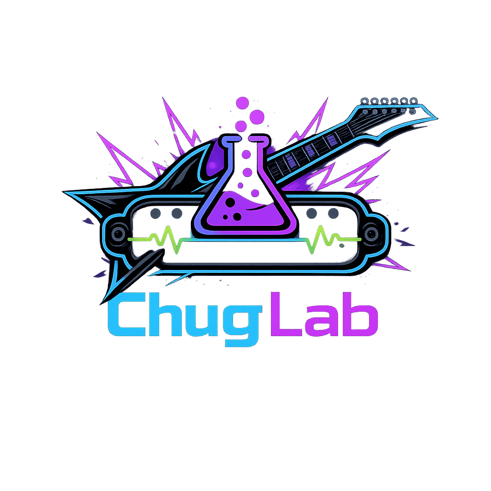

# ChugLab AI

ChugLab is a collection of AI skills for metal guitar players. Each skill is a prompt that turns your AI assistant into a specialized advisor — covering tone, gear, and technique.

## Skills

| Skill | Description |
|-------|-------------|
| [pickup-finder](pickup-finder/README.md) | Expert pickup recommendation assistant for metal players. Conducts a structured interview across instrument specs, tuning, string tension, tonal problems, rig setup, and feel — then delivers 1–3 ranked pickup recommendations. |

## Installation

Each skill has a `SKILL.md` file containing the prompt. Copy its contents and paste it as the system instructions in your AI client of choice.

### Claude (claude.ai)

1. Open [claude.ai](https://claude.ai) and create a new **Project**
2. Click **Set project instructions**
3. Paste the contents of the skill's `SKILL.md` into the instructions field
4. Save — the skill is now active for every conversation in that project

### ChatGPT

1. Go to [chatgpt.com](https://chatgpt.com) and click **Explore GPTs → Create**
2. Switch to the **Configure** tab
3. Paste the contents of the skill's `SKILL.md` into the **Instructions** field
4. Give it a name and click **Save**
5. Open your custom GPT from the sidebar whenever you need it

### Gemini (gemini.google.com)

1. Go to [gemini.google.com](https://gemini.google.com) and open **Gems** from the sidebar
2. Click **New Gem**
3. Paste the contents of the skill's `SKILL.md` into the instructions field
4. Name it and save — open the Gem any time to start a session

## What is a Skill?

A Skill is a plain text file that gives an AI assistant deep, specialized knowledge about a specific topic. Instead of asking a general-purpose AI a vague question and hoping for a useful answer, a Skill coaches it to ask the right questions, think like an expert, and give you advice that's actually tailored to your situation.

For guitarists, this matters because gear and tone are deeply personal. The "best" pickup or amp setting depends on your guitar, your tuning, your playing style, and how you want to sound — not on what works for someone else. A Skill turns a generic AI into an advisor that understands all of that before making a single recommendation.

## References

- [Agent Skills Standard](https://agentskills.io)
